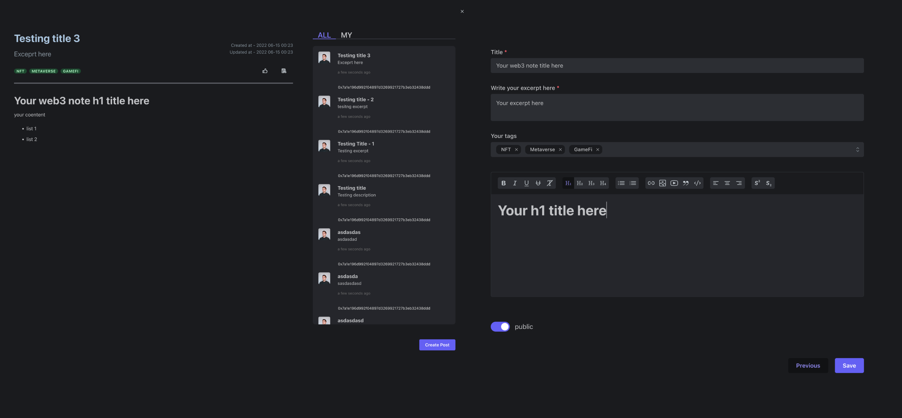

# make note on any webpage(current only support twitter), and can be an note to earn dapp

* GitHub <https://github.com/NftTopBest/web3-note-to-earn>
* note on any page(current only support twitter)）, and using the LIT to make it token gating feature, only someone have special NFT can view the note content(validate on-chain).
* note content upload to IPFS(via pinata sdk)
* the note that make token gating, only condition meet user can view the content

such as:

1. some special wallet can decode (only current wallet can decode)
2. some one have some kind of NFT can decode, so user can public some nft for reader to mint
3. user can subscribe that can pay for the content monthly

You can access <https://www.loom.com/share/760c4d4a7efe409b9b35dd0b87f39ba8> here too see the App feature

# 在任意网页都可以添加自己的笔记内容，并且可以变成赚钱渠道

* GitHub <https://github.com/NftTopBest/web3-note-to-earn>

在任意网页(目前仅支持 twitter）都可以添加自己的笔记内容，并且可以变成赚钱渠道。
笔记内容会自动上传到 IPFS，并且可以选择是否加密。
加密的笔记，可以设置成符合某种链上情况的用户可以解密阅读使用。
比如：

1. 某个特定的钱包地址可以解密（比如用户自己本身）
2. 拥有某个 NFT 的用户可以解密（这样笔记作者可以以某个主题发布 NFT，只有买了此 NFT 的用户才能看笔记内容）
3. 用户也可以按月付费订购专栏（token 自动按月支付）

您也可以访问此链接 <https://www.loom.com/share/760c4d4a7efe409b9b35dd0b87f39ba8> 查看应用程序功能
# Tech

* note content save on IPFS (via Pinata SDK)
* content ACL by LIT
* react
* chrome extension tech
